# Отчёт

## Задание 0. Расстояния между городами

**Описание задачи**:  
Составить словарь словарей расстояний между тремя городами.

**Код**:
```python
#!/usr/bin/env python3
# -*- coding: utf-8 -*-

sites = {
    'Moscow': (550, 370),
    'London': (510, 510),
    'Paris': (480, 480),
}

distances = {}

for city1, coord1 in sites.items():
    distances[city1] = {}
    for city2, coord2 in sites.items():
        if city1 != city2:
            x1, y1 = coord1
            x2, y2 = coord2
            distance = ((x1 - x2) ** 2 + (y1 - y2) ** 2) ** 0.5
            distances[city1][city2] = distance

print(distances)
```

**Скриншот**:  
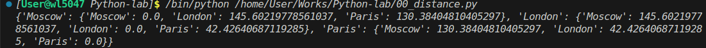

## Задание 1. Площадь круга и принадлежность точки

**Описание задачи**:  
- Вычислить площадь круга радиусом 42 с точностью до 4 знаков после запятой
- Проверить, лежат ли точки `(23, 34)` и `(30, 30)` внутри круга с центром в начале координат.

**Код**:
```python
radius = 42
pi = 3.1415926
area = pi * radius ** 2
print(round(area, 4))

point_1 = (23, 34)
distance_1 = (point_1[0] ** 2 + point_1[1] ** 2) ** 0.5
print(distance_1 < radius)

point_2 = (30, 30)
distance_2 = (point_2[0] ** 2 + point_2[1] ** 2) ** 0.5
print(distance_2 < radius)
```
**Скриншот**:  
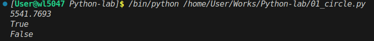

## Задание 2. Арифметическое выражение

**Описание задачи**:  
Расставить знаки операций (`+`, `-`, `*`) и скобки между числами `1 2 3 4 5`, чтобы получить результат **25**.

**Код**:
```python
result = 1 * 2 + 3 + 4 * 5
print(result)
```

**Скриншот**:  
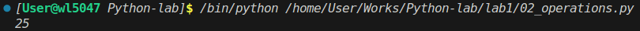

## Задание 3. Индексация строки фильмов

**Описание задачи**:  
Из строки `'Терминатор, Пятый элемент, Аватар, Чужие, Назад в будущее'` вывести:
- первый фильм,
- последний,
- второй,
- второй с конца.

**Код**:
```python
my_favorite_movies = 'Терминатор, Пятый элемент, Аватар, Чужие, Назад в будущее'

print(my_favorite_movies[0:10])
print(my_favorite_movies[-15:])
print(my_favorite_movies[12:25])
print(my_favorite_movies[-22:-17])
```

**Скриншот**:  
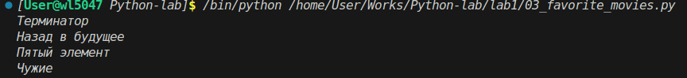

## Задание 4. Семья и рост

**Описание задачи**:  
Создать список членов семьи и список их роста. Вывести:
- рост отца,
- общий рост всей семьи.

**Код**:
```python
my_family = ['Я', 'Мама', 'Отец']
my_family_height = [
    ['Я', 181],
    ['Мама', 168],
    ['Отец', 174]
]

print(f'Рост отца - {my_family_height[2][1]} см' )
print(f'Общий рост моей семьи - {my_family_height[0][1] + my_family_height[1][1] + my_family_height[2][1]} см' )
```

**Скриншот**:  
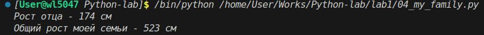

## Задание 5. Зоопарк

**Описание задачи**:  
Работа со списком животных:
- добавить медведя между львом и кенгуру,
- добавить птиц в конец,
- убрать слона,
- найти номера клеток льва и жаворонка.

**Код**:
```python
zoo = ['lion', 'kangaroo', 'elephant', 'monkey', ]
zoo.insert(1, 'bear')
print(zoo)

birds = ['rooster', 'ostrich', 'lark', ]
zoo.extend(birds)
print(zoo)

zoo.remove('elephant')
print(zoo)

lion_kletka = zoo.index('lion') + 1
lark_kletka = zoo.index('lark') + 1

print(f'Лев сидит в клетке номер {lion_kletka}')
print(f'Жаворонок сидит в клетке номер {lark_kletka}')
```

**Скриншот**:  
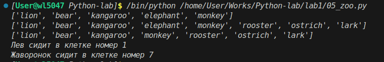

## Задание 6. Песни Depeche Mode

**Описание задачи**:  
- Из списка песен найти общую длительность трёх указанных композиций.
- Из словаря - суммарную длительность других трёх.

**Код**:
```python
violator_songs_list = [
    ['World in My Eyes', 4.86],
    ['Sweetest Perfection', 4.43],
    ['Personal Jesus', 4.56],
    ['Halo', 4.9],
    ['Waiting for the Night', 6.07],
    ['Enjoy the Silence', 4.20],
    ['Policy of Truth', 4.76],
    ['Blue Dress', 4.29],
    ['Clean', 5.83],
]

songs = round((violator_songs_list[3][1] + violator_songs_list[5][1] + violator_songs_list[-1][1]), 2)
print(f'Три песни звучат {songs} минут')

violator_songs_dict = {
    'World in My Eyes': 4.76,
    'Sweetest Perfection': 4.43,
    'Personal Jesus': 4.56,
    'Halo': 4.30,
    'Waiting for the Night': 6.07,
    'Enjoy the Silence': 4.6,
    'Policy of Truth': 4.88,
    'Blue Dress': 4.18,
    'Clean': 5.68,
}

songs_another = round((violator_songs_dict['Sweetest Perfection'] + violator_songs_dict['Policy of Truth'] + violator_songs_dict['Blue Dress']), )
print(f'Три песни звучат {songs_another} минут')
```

**Скриншот**:  
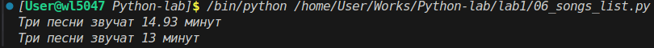

## Задание 7. Расшифровка сообщения

**Описание задачи**:  
Расшифровать фразу из 5 строк, применяя разные правила срезов к каждой строке.

**Код**:
```python
secret_message = [
    'квевтфпп6щ3стмзалтнмаршгб5длгуча',
    'дьсеы6лц2бане4т64ь4б3ущея6втщл6б',
    'т3пплвце1н3и2кд4лы12чф1ап3бкычаь',
    'ьд5фму3ежородт9г686буиимыкучшсал',
    'бсц59мегщ2лятьаьгенедыв9фк9ехб1а',
]

word_1 = secret_message[0][3]                  
word_2 = secret_message[1][9:13]               
word_3 = secret_message[2][5:15:2]          
word_4 = secret_message[3][7:13][::-1]         
word_5 = secret_message[4][16:21][::-1]   

print(f"{word_1} {word_2} {word_3} {word_4} {word_5}")
```
**Скриншот**:  
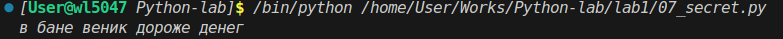

## Задание 8. Цветы в саду и на лугу

**Описание задачи**:  
Преобразовать кортежи цветов в множества и вывести:
- все виды цветов,
- пересечение (растут и там, и там),
- разность (только в саду / только на лугу).

**Код**:
```python
garden = ('ромашка', 'роза', 'одуванчик', 'ромашка', 'гладиолус', 'подсолнух', 'роза', )
meadow = ('клевер', 'одуванчик', 'ромашка', 'клевер', 'мак', 'одуванчик', 'ромашка', )

garden_set = set(garden)
meadow_set = set(meadow)

print(garden_set | meadow_set)
print(garden_set & meadow_set)
print(garden_set - meadow_set)
print(meadow_set - garden_set)
```
**Скриншот**:  
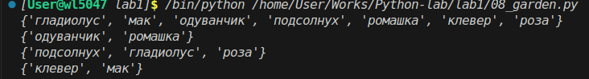

## Задание 9. Сравнение цен в магазинах

**Описание задачи**:  
Для каждой сладости найти два магазина с минимальными ценами и оформить словарь `sweets`.

**Код**:
```python
sweets = {
    'печенье': [
        {'shop': 'пятерочка', 'price': 9.99},
        {'shop': 'ашан', 'price': 10.99},
    ],
    'конфеты': [
        {'shop': 'магнит', 'price': 30.99},
        {'shop': 'пятерочка', 'price': 32.99},
    ],
    'карамель': [
        {'shop': 'магнит', 'price': 41.99},
        {'shop': 'ашан', 'price': 45.99},
    ],
    'пирожное': [
        {'shop': 'пятерочка', 'price': 59.99},
        {'shop': 'магнит', 'price': 62.99},
    ],
}
```

**Скриншот**:  
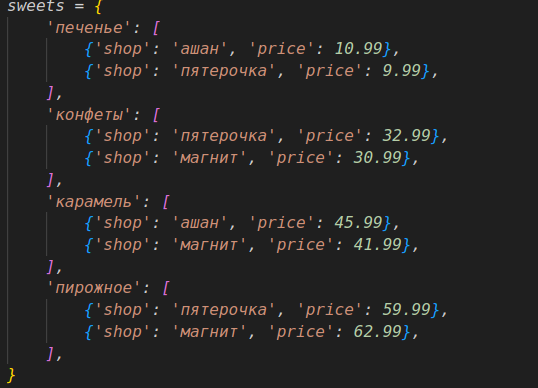

## Задание 10. Стоимость товаров на складе

**Описание задачи**:  
Без циклов рассчитать общее количество и стоимость каждого товара на складе.

**Код**:
```python
goods = {
    'Лампа': '12345',
    'Стол': '23456',
    'Диван': '34567',
    'Стул': '45678',
}

store = {
    '12345': [{'quantity': 27, 'price': 42}],
    '23456': [{'quantity': 22, 'price': 510}, {'quantity': 32, 'price': 520}],
    '34567': [{'quantity': 2, 'price': 1200}, {'quantity': 1, 'price': 1150}],
    '45678': [{'quantity': 50, 'price': 100}, {'quantity': 12, 'price': 95}, {'quantity': 43, 'price': 97}],
}

lamps_cost = store[goods['Лампа']][0]['quantity'] * store[goods['Лампа']][0]['price']
lamp_code = goods['Лампа']
lamps_item = store[lamp_code][0]
lamps_quantity = lamps_item['quantity']
lamps_price = lamps_item['price']
lamps_cost = lamps_quantity * lamps_price
print('Лампа -', lamps_quantity, 'шт, стоимость', lamps_cost, 'руб')


table_code = goods['Стол']

table_item_1 = store[table_code][0]
table_item_2 = store[table_code][1]

table_quantity = table_item_1['quantity'] + table_item_2['quantity']
table_cost = (table_item_1['quantity'] * table_item_1['price']) + \
             (table_item_2['quantity'] * table_item_2['price'])

print('Стол -', table_quantity, 'шт, стоимость', table_cost, 'руб')


sofa_code = goods['Диван']
sofa_item_1 = store[sofa_code][0]
sofa_item_2 = store[sofa_code][1]

sofa_quantity = sofa_item_1['quantity'] + sofa_item_2['quantity']
sofa_cost = (sofa_item_1['quantity'] * sofa_item_1['price']) + \
            (sofa_item_2['quantity'] * sofa_item_2['price'])

print('Диван -', sofa_quantity, 'шт, стоимость', sofa_cost, 'руб')


chair_code = goods['Стул']
chair_item_1 = store[chair_code][0]
chair_item_2 = store[chair_code][1]
chair_item_3 = store[chair_code][2]

chair_quantity = chair_item_1['quantity'] + chair_item_2['quantity'] + chair_item_3['quantity']
chair_cost = (chair_item_1['quantity'] * chair_item_1['price']) + \
             (chair_item_2['quantity'] * chair_item_2['price']) + \
             (chair_item_3['quantity'] * chair_item_3['price'])

print('Стул -', chair_quantity, 'шт, стоимость', chair_cost, 'руб')
```

**Скриншот**:  
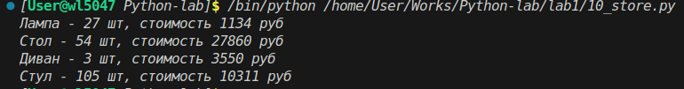