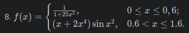
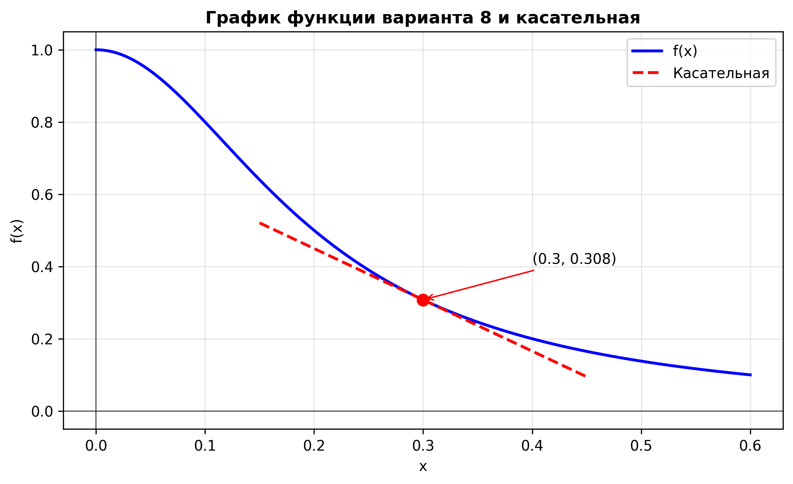

# Задание: построение графиков в Python
## Вариант 8

## 1. Описание проделанной работы:
1. Задал аналитическое выражение функции варианта 8: f(x) = 1 / (1 + 25·x^2) на интервале [0; 0.6]
2. Вычислил производную функции аналитически: f'(x) = (-50)·x / (1 + 25·x^2)^2 и реализовал её в виде отдельной функции
3. Сформировал массив значений аргумента x из 500 точек на отрезке [0; 0.6] для построения графика
4. Выбрал точку касания x0 = 0.3, вычислил координату точки y0 = f(0.3) и угловой коэффициент касательной k = f'(0.3)
5. Составил уравнение касательной в точке x0: y = y0 + k·(x - x0) и построил её на локальном интервале [0.15; 0.45]
6. Построил график функции и касательной, отметил точку касания маркером
7. Добавил аннотацию с координатами точки касания, заголовок, подписи осей, легенду, сетку и координатные оси для наглядности
8. Сохранил результат в файл graph.png с разрешением 300 DPI и вывел в консоль численные значения: координаты точки, значение производной и уравнение касательной



## 2. Программа
```python
import numpy as np
import matplotlib.pyplot as plt

def f(x):
    return 1 / (1 + 25 * x**2)

def f_prime(x):
    return -50 * x / (1 + 25 * x**2)**2

x = np.linspace(0, 0.6, 500)
y = f(x)

x0 = 0.3
y0 = f(x0)
k = f_prime(x0)

x_t = np.linspace(x0 - 0.15, x0 + 0.15, 100)
y_t = y0 + k * (x_t - x0)

plt.figure(figsize=(9, 5))
plt.plot(x, y, label='f(x)', linewidth=2, color='blue')
plt.plot(x_t, y_t, label='Касательная', linewidth=2, color='red', linestyle='--')
plt.plot(x0, y0, 'ro', markersize=8)
plt.annotate(f'({x0}, {y0:.3f})', xy=(x0, y0), xytext=(x0+0.1, y0+0.1),
             arrowprops=dict(arrowstyle='->', color='red'))

plt.title('График функции варианта 8 и касательная', fontsize=12, fontweight='bold')
plt.xlabel('x')
plt.ylabel('f(x)')
plt.legend()
plt.grid(True, alpha=0.3)
plt.axhline(0, color='k', linewidth=0.5)
plt.axvline(0, color='k', linewidth=0.5)

plt.savefig('task4_graph.png', dpi=300, bbox_inches='tight')
plt.show()

print(f"Точка: x₀={x0}, f(x₀)={y0:.4f}, f'(x₀)={k:.4f}")
print(f"Касательная: y = {y0:.4f} + {k:.4f}(x - {x0})")
```

## 3. Вывод
- Построил график первой части кусочной функции варианта 8 на интервале [0; 0.6]. Касательная построена в точке x0 = 0.3.
Параметры:
- Точка касания: (0.3; 0.308)
- Угловой коэффициент: k ≈ -1.42
- Уравнение касательной: y = 0.308 - 1.42(x - 0.3)

## Использованные источники:
1. [Devpractice Team. Библиотека Matplotlib.](https://evil-teacher.orbiter.website/books/prog_pm/matplotlib.pdf)