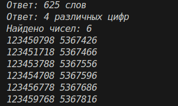

# Отчёт
## 1. Условия задач (Вариант 8)
### Задание 1
Рассматриваются символьные последовательности длины 6 в пятибуквенном алфавите {К, А, Т, Е, Р}. Сколько существует таких последовательностей, которые начинаются с буквы Р и заканчиваются буквой К?
### Задание 2
Вычислить значение выражения:
216^6+216^4+36^6-6^14-24
Записать полученное число в системе счисления с основанием 6. Определить количество различных цифр в этой записи.
### Задание 3
Найти все натуральные числа, не превышающие 10^9, соответствующие маске 12345?7?8, где:
? — ровно одна произвольная цифра;
Число должно делиться на 23 без остатка.
Вывести найденные числа в порядке возрастания и частное от их деления на 23.

## 2. Описание проделанной работы:
1. Импортировал модуль itertools для генерации комбинаций в первой задаче.
2. Реализовал функцию task1_vasya_words():
- Сгенерировал все 6-буквенные комбинации из алфавита {К, А, Т, Е, Р}.
- Применил фильтрацию: последовательность начинается с «Р» и заканчивается на «К».
- Подсчитал количество подходящих слов.
3. Реализовал функцию task2_count_ones():
- Вычислил значение выражения 216^6+216^4+36^6-6^14-24
- Перевёл полученное число в систему счисления с основанием 6 через цикл деления с остатком.
- Определил количество различных цифр с помощью множества set.
4. Реализовал функцию task3_find_numbers():
- Организовал двойной перебор цифр вместо знаков вопроса в маске 12345?7?8.
- Сформировал числа и отфильтровал их по условиям: значение <= 10^9 и делимость на 23 без остатка.
- Отсортировал найденные пары (число, частное) по возрастанию.
5. Протестировал программу и зафиксировал результаты
```python
import itertools

def task1_vasya_words():
    alphabet = ['К', 'А', 'Т', 'Е', 'Р']
    count = 0
    for p in itertools.product(alphabet, repeat=6):
        if p[0] == 'Р' and p[-1] == 'К':
            count += 1
    return count

def task2_count_ones():
    val = (216**6) + (216**4) + (36**6) - (6**14) - 24
    if val == 0: return 1
    digits = []
    while val > 0:
        digits.append(str(val % 6))
        val //= 6
    return len(set(digits))

def task3_find_numbers():
    results = []
    for d1 in range(10):
        for d2 in range(10):
            num = int(f"12345{d1}7{d2}8")
            if num <= 10**9 and num % 23 == 0:
                results.append((num, num // 23))
    return sorted(results)

print(f"Ответ: {task1_vasya_words()} слов")
print(f"Ответ: {task2_count_ones()} различных цифр")

ans3 = task3_find_numbers()
print(f"Найдено чисел: {len(ans3)}")
for num, div in ans3:
    print(num, div)
```
## 3. Скриншот

## 4. Используемы материалы
1. [Itertools в Python](https://habr.com/ru/companies/otus/articles/529356/)
2. [itertools - Functions creating iterators for efficient looping](https://docs.python.org/3/library/itertools.html)
3. [Итерируем правильно: 20 приемов использования в Python модуля itertools](https://proglib.io/p/iteriruemsya-pravilno-20-priemov-ispolzovaniya-v-python-modulya-itertools-2020-01-03)