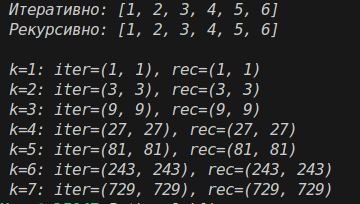

# Отчёт
## 1. Условия задач (Вариант 8)
### Задание 1
Линеаризовать вложенный список (преобразовать [1, [2, [3]]] в [1, 2, 3]). 
Реализовать рекурсивный и итеративный варианты.
Пример:
- linearize([1, 2, [3, 4, [5, [6, []]]]]) → [1, 2, 3, 4, 5, 6]

### Задание 2
Вычислить k-й член последовательности:

aₖ = 2bₖ₋₁ + aₖ₋₁; 
bₖ = 2aₖ₋₁ + bₖ₋₁

Начальные условия: a₁ = b₁ = 1
Реализовать рекурсивный и итеративный варианты.

## 2. Описание проделанной работы:
1. Линеаризация:
- linearize_rec - рекурсивно обходит элементы; если элемент — список, вызывает себя для него, иначе добавляет число в результат.
- linearize_iter - использует стек (list) для хранения элементов. Извлекает элементы из стека: списки раскрывает и кладёт обратно, числа добавляет в итоговый массив.
2. Последовательность:
- calc_ab_iter - цикл от 2 до k, обновляющий переменные a и b по формулам.
- calc_ab_rec - рекурсия с декоратором @lru_cache для кэширования результатов и избежания повторных вычислений.
```python
from functools import lru_cache

# Задание 1
def linearize_iter(lst):
    result, stack = [], lst[::-1]
    while stack:
        item = stack.pop()
        if isinstance(item, list):
            stack.extend(item[::-1])
        else:
            result.append(item)
    return result

def linearize_rec(lst):
    result = []
    for item in lst:
        if isinstance(item, list):
            result.extend(linearize_rec(item))
        else:
            result.append(item)
    return result

# Задание 2
def calc_ab_iter(k):
    if k < 1: return None
    a = b = 1
    for _ in range(2, k + 1):
        a, b = 2*b + a, 2*a + b
    return a, b

@lru_cache(maxsize=None)
def calc_ab_rec(k):
    if k == 1: return (1, 1)
    a_prev, b_prev = calc_ab_rec(k - 1)
    return (2*b_prev + a_prev, 2*a_prev + b_prev)

# Вывод результатов 
if __name__ == "__main__":
    test_list = [1, 2, [3, 4, [5, [6, []]]]]
    print(f"  Итеративно: {linearize_iter(test_list)}")
    print(f"  Рекурсивно: {linearize_rec(test_list)}")
    
    print('')
    for k in range(1, 8):
        iter_res = calc_ab_iter(k)
        rec_res = calc_ab_rec(k)
        print(f"  k={k}: iter={iter_res}, rec={rec_res}")
```
## 3. Скриншот

## 4. Используемы материалы
1. [Recursion in Programming - Full Course - freeCodeCamp.org](https://youtu.be/IJDJ0kBx2LM)
2. [Самоучитель по Python для начинающих. Часть 13: Рекурсивные функции - proglib.io](https://proglib.io/p/samouchitel-po-python-dlya-nachinayushchih-chast-13-rekursivnye-funkcii-2023-01-23)
3. [Как работает рекурсия – объяснение в блок-схемах и видео - Хабр](https://habr.com/ru/articles/337030/)