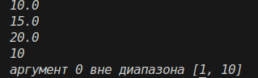

# Отчёт
## 1. Условия задач (Вариант 8)
### Задание 1
Реализовать замыкание, создающее функцию для накопительного вычисления среднего арифметического переданных чисел.
### Задание 2
Реализовать декоратор, проверяющий типы и диапазоны значений аргументов функции. При ошибке должно выбрасываться исключение. Применить декоратор к функции внутри замыкания.
## 2. Описание проделанной работы:
### 2.1 Реализация замыкания

Создана функция make_averager(). Внутри неё определён список history для хранения истории вызовов. Вложенная функция averager(*args) добавляет новые числа в список и возвращает среднее арифметическое всех накопленных значений.

### 2.2 Реализация декоратора

Написан параметризованный декоратор validate_args(types, ranges). Он принимает словари с правилами валидации по индексам аргументов:
- types: проверка типа через isinstance.
- ranges: проверка попадания значения в интервал [min, max].
При нарушении условий выбрасываются TypeError или ValueError.

### 2.3 Применение декоратора к замыканию

Декоратор применён к внутренней функции averager внутри make_averager с помощью синтаксиса @validate_args(...). Это обеспечивает проверку входных данных (только числа) перед их добавлением в историю.

```python
import functools

def validate_args(types=None, ranges=None):
    types = types or {}
    ranges = ranges or {}
    
    def decorator(func):
        @functools.wraps(func)
        def wrapper(*args, **kwargs):
            for i, arg in enumerate(args):
                if i in types and not isinstance(arg, types[i]):
                    raise TypeError(f"аргумент {i} в диапазоне {types[i]}, {type(arg)}")
                if i in ranges:
                    min_v, max_v = ranges[i]
                    if not min_v <= arg <= max_v:
                        raise ValueError(f"аргумент {i} вне диапазона [{min_v}, {max_v}]")
            return func(*args, **kwargs)
        return wrapper
    return decorator

def make_averager():
    history = []
    
    @validate_args(types={0: (int, float)})
    def averager(*args):
        history.extend(args)
        return sum(history) / len(history)
        
    return averager

if __name__ == "__main__":
    avg = make_averager()
    print(avg(10))
    print(avg(20))
    print(avg(30))
    
    @validate_args(types={0: int}, ranges={0: (1, 10)})
    def test_func(x):
        return x * 2
        
    print(test_func(5))
    try:
        print(test_func(15))
    except Exception as e:
        print(e)
    
```
## 3. Скриншот

## 4. Используемы материалы
1. [Самоучитель по Python для начинающих. Часть 13: Рекурсивные функции - proglib.io](https://proglib.io/p/samouchitel-po-python-dlya-nachinayushchih-chast-13-rekursivnye-funkcii-2023-01-23)
2. [Как работает рекурсия – объяснение в блок-схемах и видео - Хабр](https://habr.com/ru/articles/337030/)