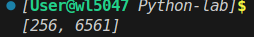

# Отчёт

## 1. Условия задач (Вариант 8)

### Задание
**Генератор, применяющий заданную функцию к каждому элементу последовательности N раз.**

Реализовать генератор, который принимает последовательность, функцию и число N. Генератор должен применять заданную функцию к каждому элементу последовательности ровно N раз.

## 2. Описание проделанной работы

Написана функция-генератор `apply_func_n_times`.
Последовательность работы:
1. Берем элемент из последовательности.
2. В цикле применяем к нему функцию N раз.
3. Возвращаем результат через `yield`.

```python
def apply_func_n_times(sequence, func, n):

    for item in sequence:
        result = item
        for _ in range(n):
            result = func(result)
        yield result

if __name__ == "__main__":
    # Пример: возводим 2 в квадрат 3 раза 
    data = [2, 3]
    func = lambda x: x ** 2
    n = 3
    
    print(list(apply_func_n_times(data, func, n)))
```
## 3. Скриншот

## 4. Используемы материалы
1. [Генераторы в Python](https://habr.com/ru/articles/866616/)