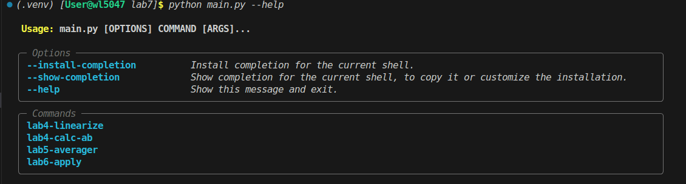
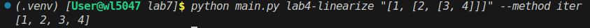
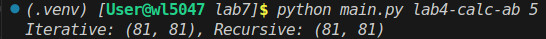
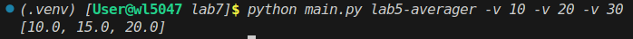
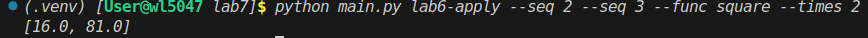

# Лабораторная работа №7: Пакеты и модули

## Условия задач

1. **Модуль lab4**: Реализация функций линеаризации вложенного списка (итеративный и рекурсивный методы) и вычисления элементов последовательности A_k, B_k.
2. **Модуль lab5**: Создание декоратора `validate_args` для проверки типов и диапазонов аргументов, а также функции-фабрики `make_averager` для вычисления скользящего среднего.
3. **Модуль lab6**: Реализация генератора `apply_func_n_times`, применяющего заданную функцию N раз к каждому элементу последовательности.

## Описание проделанной работы

1. Создан пакет `Modules`, содержащий три модуля: `lab4.py`, `lab5.py`, `lab6.py`.
2. Из исходных файлов удален код самопроверки (`if __name__ == "__main__":`), оставлены только определения функций.
3. В файле `__init__.py` настроен импорт основных функций для удобства доступа.
4. Разработан запускающий модуль `main.py` с использованием библиотеки `Typer`. Он предоставляет интерфейс командной строки (CLI) для вызова функций из пакета с передачей параметров.
5. Реализованы следующие команды CLI:
   - `lab4-linearize`: Линеаризация списка. Принимает строку со списком и метод (`iter`/`rec`).
   - `lab4-calc-ab`: Расчет последовательности. Принимает индекс `k`.
   - `lab5-averager`: Вычисление среднего. Принимает список чисел через опцию `-v`.
   - `lab6-apply`: Применение функции. Принимает последовательность, имя функции (`square`/`double`/`increment`) и количество повторений.

## Скриншоты результатов

### Запуск справки по программе

### Тестирование lab4-linearize

### Тестирование lab4-calc-ab

### Тестирование lab5-averager

### Тестирование lab6-apply

*(Примечание: Замените пути к изображениям на реальные скриншоты после выполнения программы)*

## Ссылки на используемые материалы

1. [Документация Python: Модули и пакеты](https://docs.python.org/3/tutorial/modules.html)
2. [Документация Typer](https://typer.tiangolo.com/)
3. [Модуль functools (lru_cache, wraps)](https://docs.python.org/3/library/functools.html)
4. [Генераторы в Python](https://docs.python.org/3/howto/functional.html#generators)
